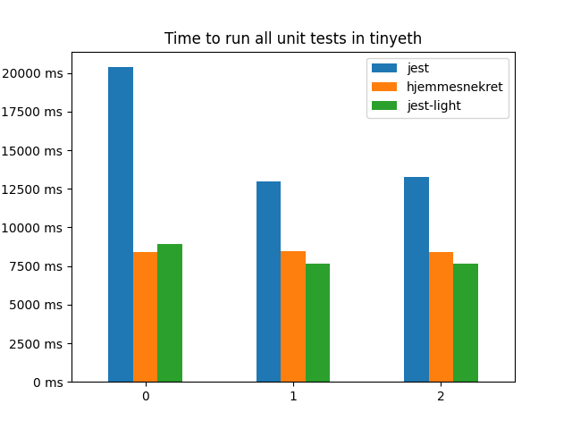

## Hjemmesnekret

(Simple) proof of concept testing framework to profile other tests frameworks. Same interface as `jest` to make it easy to switch to.

# Speed vs jest
Here is the time difference for running all tests in [tinyeth](https://github.com/2xic/tinyeth) between hjemmesnekret and jest.

Jest does some cacheing, and that's why the speed decreases after the first run for jest.

# Functionality
- describe, it, beforeEach, beforeAll
- expect
  - toBeTruthy
  - toHaveLength
  - toBeInstanceOf
  - toBe
  - toBeDefined
  - toBeUndefined
  - toBeLessThan
  - toBeLessThanOrEqual
  - toBeGreaterThanOrEqual
  - toBeGreaterThan
  - toContain
  - toContainEqual
  - toEqual
  - toMatchObject
  - toBeFalsy
  - toThrowError
  - toThrow
  - rejects and resolves

# TODO
Some features I still want to add.

- `jest timer`
- `inline snapshot`
- Add object differ, and improved error messages
- Add a real stacktrace with support for js.map
